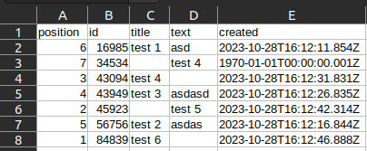

# typescript-keep-json-to-csv

Study project to parse keep json to csv file.

## Getting Started

Install dependencies

```console
yarn
```

Replace json on input.ts

Start the server

```console
yarn dev
```

Result will be on output.csv




## Built With

- [Typescript](https://www.typescriptlang.org/)
- [Node.js](https://nodejs.org/en/)

## License

This project is licensed under the MIT License
